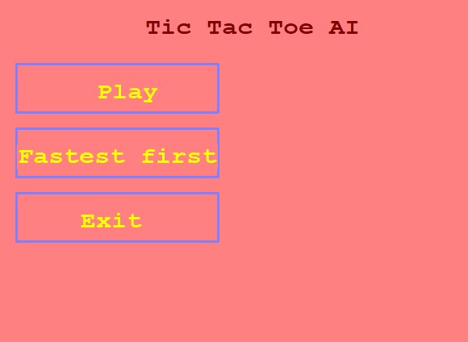
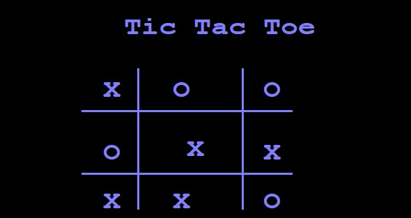
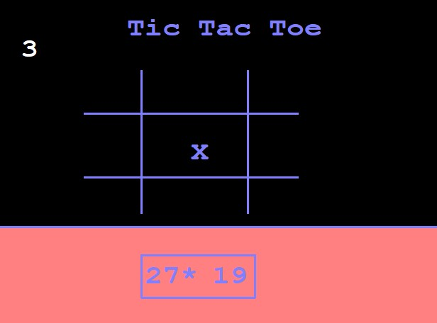
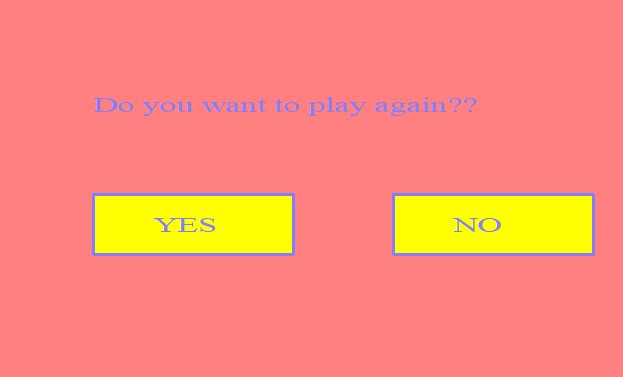
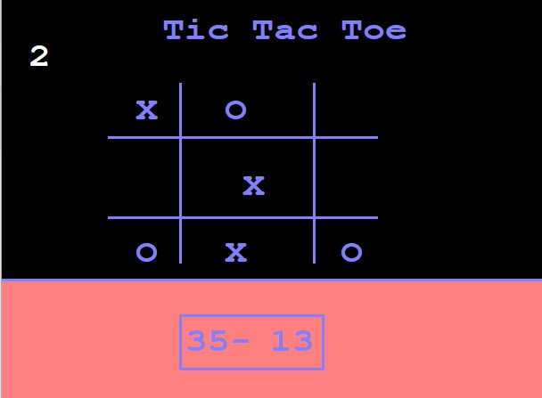

  

# 😲 **_Tic-Tac-Toe-AI-Intregrated_** 😲
## What is the meaning of _AI Intregrated_ 🙋‍♀️🙋‍♂️❓❓
### You all have Played _Tic Tac Toe_ in your life if you don't know what is tic tac toe [Learn](https://en.wikipedia.org/wiki/Tic-tac-toe) `AI Intregrated` means you will play with Computer..
## What's New❓❓
* Well In normal game you can choice that you want to play first or second but here Toss Decide that who will move first.
* New concept implemented `Fastest First` Here a basic operator question will ask i.e. `3+4,13*43` etc if you answer the question right,in 5 Seconds you will move if wrong or the time over then Computer will [move see how it's work](https://youtu.be/ru3f1rn2mf8)
## Screenshots

<h2> Show  💖💖 By Staring Project Guidance</h2>
<h3><a href="https://youtu.be/ru3f1rn2mf8">Watch Video on Youtube</a>
 
<a href="https://www.linkedin.com/in/ujjwal-gupta-ug-233543202/">Connect With Me👐</a></h3>
